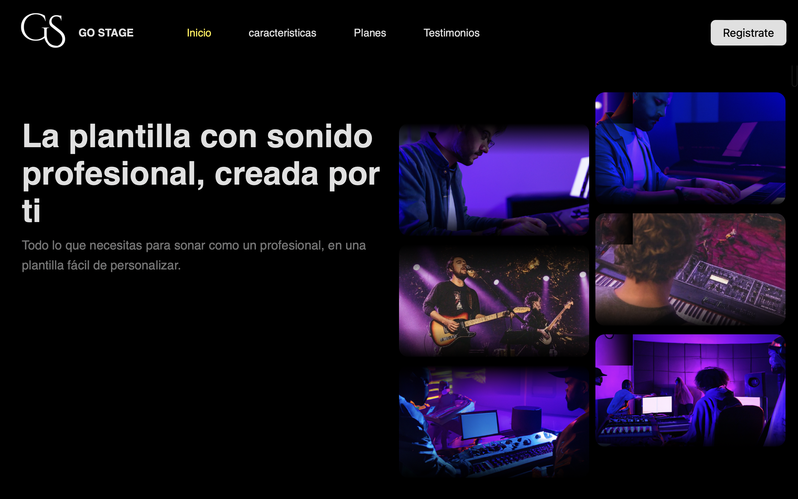
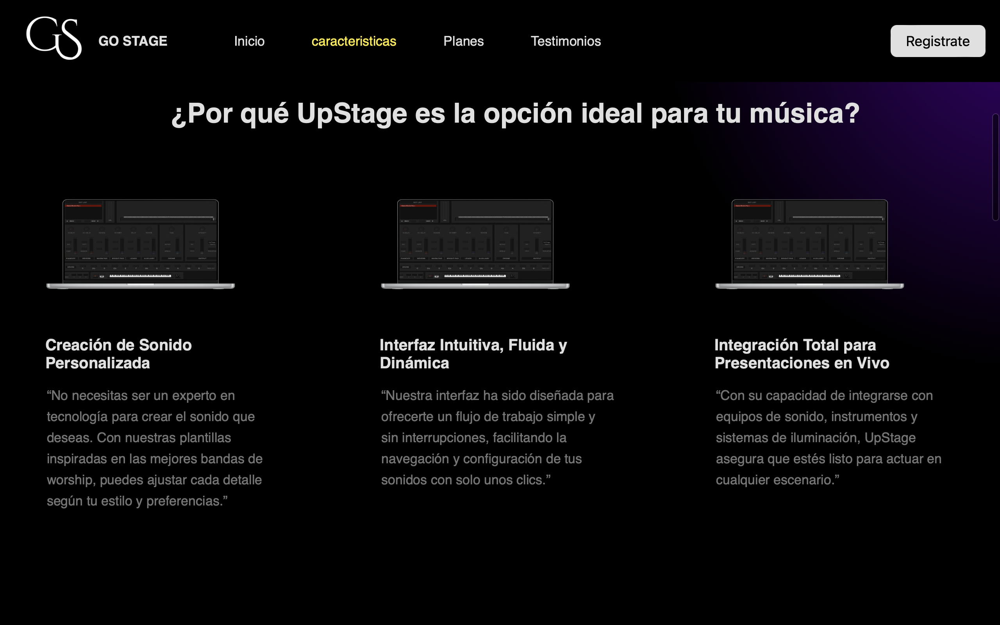
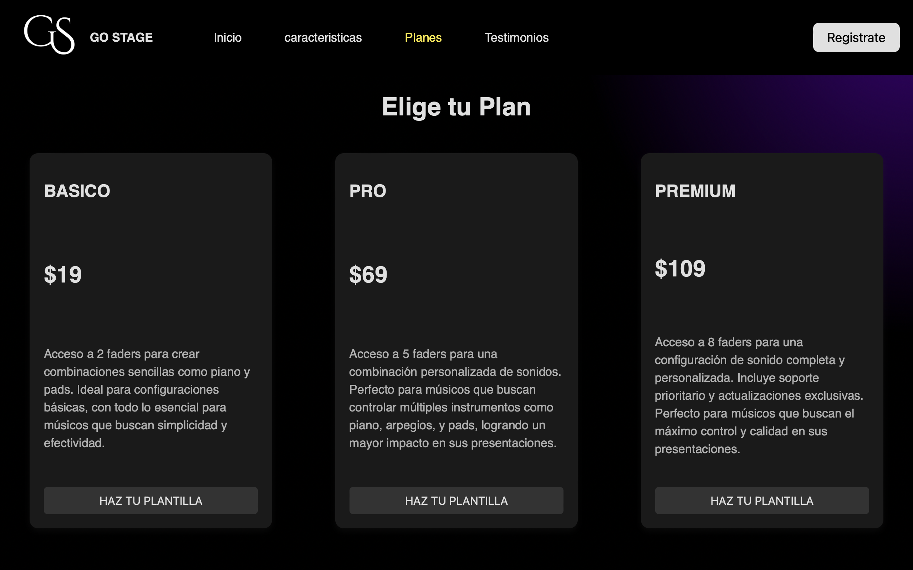

# Proyecto 3: Página Web - GO STAGE

**Descripción**  
GO STAGE es una página web que proporciona una herramienta interactiva para la creación de plantillas de sonido personalizables, diseñada para músicos, especialmente pianistas de iglesias y bandas de worship. La interfaz permite elegir entre distintos planes, ajustar combinaciones de sonido mediante faders y explorar plantillas de calidad profesional sin necesidad de conocimientos avanzados de configuración.

## Funcionalidades Principales

- **Barra de navegación**: Acceso rápido a secciones clave como Inicio, Características, Planes y Testimonios.
- **Sección HERO**: Título llamativo y opciones visuales para captar la atención de los usuarios.
- **Características**: Presentación de beneficios clave, como creación de sonido personalizada, interfaz intuitiva e integración con equipos de sonido.
- **Planes de suscripción**: Tres niveles (Básico, Pro y Premium) para una experiencia personalizada según las necesidades del usuario.
- **Testimonios**: Comentarios de usuarios destacados que resaltan la efectividad y facilidad de GO STAGE.

## Estructura de Archivos

- **HTML**: Estructura de la página con secciones para navegación, contenido y pie de página.
HEAD
- **CSS**: Archivo de estilos externos
=======
- **CSS**: Archivo de estilos externos que proporciona la apariencia y el diseño visual.
- **Imágenes y recursos**: Carpeta de imágenes para logos, íconos y gráficos usados en la página.

## Tecnologías Utilizadas

- **HTML5** para la estructura del contenido.
- **CSS3** para el estilo y el diseño de la página.
- **JavaScript** (opcionalmente) para futuras interacciones dinámicas en el sitio.

## Instalación

1. **Clonar el repositorio**:
   ```bash
   git clone git@github.com:Davidbustosr/proyecto-3.git
   ```
2. **Abrir el archivo** `index.html` en tu navegador para ver la página.

## Capturas de Pantalla

A continuación, algunas capturas de pantalla de la página GO STAGE:

- **Pantalla Principal (Hero)**  

  

- **Sección de Características**  

  

- **Sección de Planes**  

  


## Próximas Mejoras

- **Interacciones Dinámicas**: Agregar funcionalidades con JavaScript para mejorar la personalización de plantillas en tiempo real.
- **Soporte Multilenguaje**: Implementar soporte para varios idiomas en la página.
- **Integración de Pago**: Ofrecer métodos de pago seguros para la suscripción a los diferentes planes.
- **Optimización para SEO**: Mejorar la visibilidad de la página en motores de búsqueda.

## Contribuciones

Las contribuciones son bienvenidas. Si deseas mejorar alguna funcionalidad o añadir características, sigue estos pasos:

1. **Haz un fork** del repositorio.
2. **Clona** el proyecto.
3. Crea una nueva **rama** para tu modificación.
4. Haz un **pull request** detallando tus cambios.

